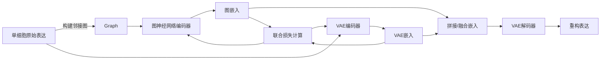
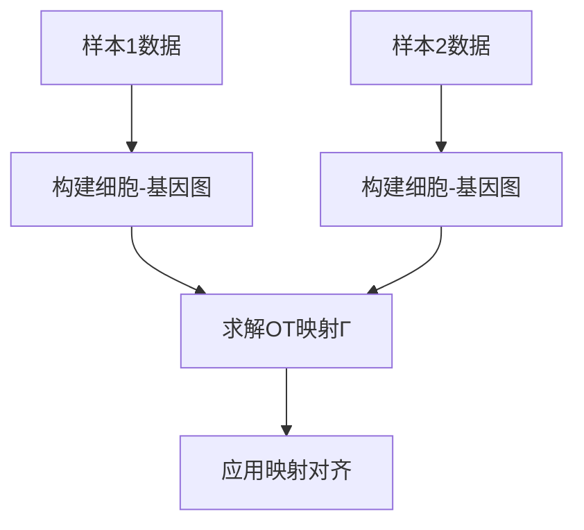
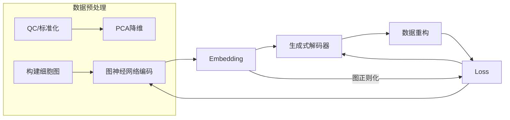

# 执行摘要  
单细胞数据的多样本整合目标在于将来自不同供体、不同实验批次（batch）或不同条件的数据融合为一致的表示，同时尽量消除技术偏差而保留真实的生物学差异【22†L180-L188】【4†L219-L223】。本报告首先明确多样本整合的问题定义和评估指标（如批次混合度、细胞类型纯度、kBET、LISI、ARI、轮廓系数、图连通性等），并说明如何在多模态情景下计算这些指标（如将不同组学视为类簇计算组学混合度【29†L1312-L1320】）。接着，我们系统梳理了整合方法类别：基于批次校正（如ComBat、MNNCorrect、Harmony）、基于对齐/映射（如CCA、Seurat v3/v4、LIGER）、基于对比学习与自监督（如SimCLR/CLIP类方法、CLAIRE【22†L149-L157】）、基于图神经网络（如scMoGNN【34†L61-L64】）、基于生成模型（如VAE系的scVI/totalVI、CycleGAN、最优传输FGOT【12†L79-L88】【29†L1312-L1320】）以及基于锚点对齐与标签传播（如基于互邻的锚点匹配、标签传播）等。我们对每类方法列出优缺点、适用场景、关键超参、复杂度和可扩展性，并讨论其对缺失模态和细胞类型不一致问题的鲁棒性。随后提出三种新的可行策略：**多样本感知的对比学习**（引入批次感知的负样本采样策略以改善mix-heterogeneity权衡）、**图-生成混合模型**（将图卷积与生成式网络结合，同时进行图结构对齐和数据重构）、**基于最优传输的跨样本跨模态对齐**（联合优化样本间和组学间的匹配）。对每种策略给出算法框架、损失函数形式、训练流程图示及关键超参建议，并分析其预期优势与潜在风险。最后设计详细实验方案：列出如BMMC多模态数据（GSE194122【39†L36-L44】）、人类肾脏多重组学数据（GSE254185【41†L71-L79】）等公开多样本多组学数据集及其样本数、模态类型和已知批次信息；说明预处理流程（如QC、归一化、HVG选择、批次标签编码等）、对比方法列表、评价流程（指标计算及统计检验）、消融实验设计（如组件重要性分析）以及所需计算资源预估。最后给出工程实现建议，包括数据管道设计、可复现训练/评估脚本结构、模型部署和增量学习策略。报告中使用表格对比方法与数据集，并通过Mermaid流程图演示关键算法流程。所有内容优先引用最新原始论文和官方代码仓库作为依据。  

## 1. 问题定义  
多样本整合（multi-sample integration）指在单细胞实验中，将来自不同**样本**（不同供体、实验批次或条件）的数据联合分析，消除技术变异而保留细胞类型及状态的真实生物学差异【22†L180-L188】【4†L219-L223】。批次效应（batch effect）是指由不同批次的实验条件引起的技术性差异，它可能掩盖生物信号。多样本整合即在不同样本间消除或校正这类批次效应。相比之下，多组学整合侧重于将不同组学（如RNA-Seq、ATAC-Seq、蛋白质组）数据进行联合分析，尽管在本报告中多组学整合已经相对成熟，我们主要关注多样本背景下的算法优化和评估。  
多样本整合的目标常包括：**去除批次影响**、**保持细胞类型和状态差异**、**提高下游分析（如聚类、谱系推断）可靠性**。重要的是考虑数据的复杂性，如多个供体、多个实验室、不同协议以及细胞组成差异等【4†L121-L128】。在多组学情景下，还需考虑不同模态数据的对齐关系，但本报告侧重于样本层面的整合技术。  

## 2. 评估指标与计算方法  
有效整合方法应兼顾**批次混合度**与**生物差异保留**两方面。常用的评估指标包括：

- **kBET（k-最近邻批次效应检验）**：在低维嵌入或整合后空间构建kNN图，对每个细胞的邻域中批次标签分布做卡方检验。若邻域中的细胞来自不同批次的比例与全局相似，则视为混合良好【33†L25-L32】。kBET分数越高表示批次效应去除越彻底，可在多样本间统一评估。

- **LISI（Local Inverse Simpson’s Index）**：局部多样性测度，包括**bLISI**（衡量批次混合）和**cLISI**（衡量细胞类型保真度）。例如，图版本的iLISI在整合后数据的kNN图上计算每个细胞邻域的批次多样性，并取平均【4†L219-L223】。

- **ARI/NMI（调整的兰德指数/归一化互信息）**：比较整合后聚类结果与已知细胞类型标签的一致性，评估生物学信号保留。ARI值越高说明细胞类型划分越准确。

- **轮廓系数（Silhouette）**：可分别按细胞类型标签或批次标签计算。细胞类型轮廓值度量同类型细胞间聚合程度；批次轮廓值度量批次混合情况（值越低说明批次混合越好）【4†L219-L223】。

- **图连通性（Graph Connectivity）**：按图中每种已知细胞类型计算其连通分量。具体定义为每种类型的最大连通分量大小占该类型细胞总数的比例，再对所有细胞类型取平均【29†L1312-L1320】。值越大表示同一种细胞类型被连成更大的连通子图，说明不同批次的同类细胞融合度更高。

- **批次熵混合度（Batch Entropy Mixing）**：计算样本在局部邻域中的香农熵，衡量批次标签分布是否均匀。

在**多组学情景**下，这些指标可以在**联合嵌入空间**计算。常见做法是：将所有细胞在整合后嵌入到相同的低维空间，或构建包含不同组学节点的图，随后按上述方式计算指标。例如，可将**组学类型**视为一类“标签”，计算组学层面的ASW：即对每个细胞计算其不同组学邻居的silhouette值来度量组学之间的混合度【29†L1305-L1313】。图连通性也可应用于评估不同模态间的混合（见下文FGOT方法中组学混合度定义【29†L1312-L1320】）。总之，多模态整合时，可将**组学分布混合度**作为额外指标：如“omics mixing”指标将Seurat对齐分数、组学层ASW和图连通性加权平均【29†L1327-L1335】。在多样本场景，通常忽略不同模态的对齐质量评价（假设已由多组学方法处理），专注于整体嵌入的批次与类型指标。

## 3. 方法类别比较  

### 3.1 基于批次校正的方法  
**ComBat**：源自批量校正的经典线性模型，将每个基因表达视为批次固定效应和随机误差的组合【22†L187-L194】。优点是简单、可解释、快速；缺点是假设每个基因的批次效应可加性分离，难以处理细胞组成差异大的情况，以及无法建模非线性效应【22†L187-L194】。关键超参通常为贝叶斯参数平滑系数；计算复杂度低。可扩展性高，但对多组学不适用，仅针对单一基因表达。对缺失细胞类型鲁棒性差（相当于校准整体分布而忽略细胞亚群差异）。

**MNNCorrect（Mutual Nearest Neighbors）**：通过在不同样本中寻找互为最近邻的细胞对（anchor）来校正数据【22†L193-L202】。方法流程是先进行PCA降维，然后迭代对齐：每次取两个批次，用互最近邻对在潜在空间中平移一批次，以减少批次间偏差。优点是不依赖预先标注且能捕获非线性结构；缺点是计算复杂度高（邻域搜索），对参数（如邻居数）敏感，对稀疏的数据和大规模数据扩展性有限。对缺失模态无处理，对不重叠细胞类型时可能错误匹配。

**Harmony**：一种基于软聚类的迭代整合算法。它在PCA空间上进行聚类，并通过最大化不同批次在同一聚类中的混合度来调整细胞在低维空间的位置。相比其他方法，Harmony通常较稳定，并易于处理多个批次【32†L23-L32】。关键超参包括聚类数目和收敛阈值。Harmony在保留复杂生物结构时表现较好【32†L49-L53】【32†L72-L80】；其重点放在保留细胞差异而弱化批次，而非完全消除批次。复杂度适中，可扩展至数十万细胞【32†L49-L53】。对缺失模态不适用；对不一致的细胞类型较鲁棒，但在批次影响极强时可能未能完全校正【32†L72-L80】。

**BBKNN**（Batch-Balanced KNN）：在构建图邻居时强制均衡考虑批次，每个细胞从每个批次选取固定数目的邻居【7†L2070-L2073】。算法流程：先进行PCA，然后在kNN构建时指定每批次邻居数。优点是直接得到图结构输出，无需校正表达矩阵；缺点是结果依赖k值和各批样本量，对高维数据有一定计算开销。对多模态可处理融合后的共同空间，对缺失细胞类型有一定容忍度，但需仔细调整每批邻居数。

### 3.2 基于对齐/映射的方法  
**CCA/Seurat v3/v4**：使用对齐算法基于正交偏最小二乘CCA寻找不同样本中的“锚点细胞对”【22†L193-L202】。Seurat v3提出了Anchor框架：在降维空间找出跨批次的互近邻作为锚点，然后学习一个变换将锚点配对对齐【5†L1415-L1423】。优点是无需监督标签、可灵活对齐不同实验；缺点是计算量大（需找锚点并配对）、对高维数据敏感、对大型数据集扩展性有限。关键超参包括锚点数目、PCA维度等。对缺失的模态，可以在对应共享特征（如用基因）空间上对齐；不一致细胞类型会导致锚点误配，但Seurat会根据共表达特征加权锚点，略有缓解。

**LIGER**：基于联合非负矩阵分解（iNMF），将多个数据集分解成共享因子和组学特异因子【32†L66-L74】。它能够同时处理多组学数据，例如将RNA和ATAC视作不同视图，共享细胞因子提升对齐效果【32†L66-L74】。优点是可解释性较强，适合大规模数据；缺点是需要调参（共享因子数目）、对初始化和局部最优敏感。可扩展性较好，支持在线版本。对于缺失模态，通过不激活特定因子应对；对不一致的细胞类型，LIGER会为独有细胞类型生成独立因子，但可能无法完全分离。

**Conos**：先对每对批次分别进行双向聚类，然后通过细胞相似度图将批次连接成大图来实现整合。它强调图结构整合而非嵌入空间对齐。优点对大规模数据有较好扩展性；缺点是对参数（如近邻数）敏感，对细胞类型不一致较鲁棒（孤立细胞在图中自然隔离）。多组学集成需先将不同组学投影到公共空间。

### 3.3 基于对比学习与自监督的方法  
这一类方法应用对比学习（Contrastive Learning, CL）思路，构造正例对和负例对，以无监督方式学习细胞嵌入。**SimCLR、MoCo、BYOL、SimSiam**等视觉领域的自监督算法已被移植至单细胞分析。最近提出的**CLAIRE**方法即在对比学习框架中加入批次感知正负例构建：它动态构造跨批次MNN正例，并用批内KNN扩大覆盖，同时利用网络记忆效应筛除潜在假正例【22†L149-L157】。优点是能在无标签下学习表示，增强模型对数据变换不变；缺点是训练需要大量数据和精心设计的数据增强方式（如单细胞噪声、基因遮掩、邻域混合等【19†L165-L173】）、计算开销大。关键超参包括投影头维度、温度系数、正/负样本比例。对批次校正能力强（CLAIRE在多个真实数据集上显示卓越表现【22†L155-L159】），但易出现“表示崩塌”问题，需要额外策略（如动量编码器）。多模态情景下，可设计跨模态对比（如匹配同细胞不同组学的表示）。对缺失细胞类型通常较鲁棒，因为它不依赖明确标签；对缺失模态需结合多头编码器并定义正例为跨模态相同细胞对。

### 3.4 基于图神经网络的方法  
图神经网络（Graph Neural Networks, GNN）通过显式建模细胞间关系来整合数据。**scMoGNN**等方法构造跨细胞图，将不同模态的数据节点通过已知对应（如同一细胞的不同组学数据或相似细胞）相连，然后使用GCN/GAT编码器学习联合嵌入【34†L61-L64】。优点是能捕获局部拓扑结构和全局关系，适合引入先验图结构（如细胞通信图），处理复杂非线性关系；缺点是对图构建参数敏感（邻居数、边权重），计算复杂度高（大规模图需采样或图池化），扩展性受限。超参包括图层数、隐藏维度、聚合方式等。此类方法天然支持多模态：可构造异质图（节点类型区分组学），对缺失模态可通过图结构间接推断；对细胞类型不一致，图结构会反映类型孤立（难以匹配），鲁棒性依赖图连通策略。示例代码可参考作者已开源的DANCE库【34†L61-L64】等。

### 3.5 基于生成模型的方法  
生成式模型（Generative Model）通过概率模型或深度网络显式生成数据。常见有**变分自编码器（VAE）**系列：如**scVI**（仅RNA）、**scANVI**（RNA+标签）、**totalVI**（RNA+ADT）等【22†L193-L202】；此外还有基于GAN的**scGen/AutoEncoder**和利用**循环GAN/CycleGAN**进行域对齐的工作，以及基于**最优传输（Optimal Transport, OT）**的方法如FGOT【12†L79-L88】。优势在于模型表达能力强，可模拟复杂非线性效应并提供隐变量解释，scANVI可利用细胞类型标签提升性能；缺点在于训练复杂（需调参网络结构、学习率等）、可能不稳定、重现性较差。关键超参包含潜在空间维度、层数、正则化权重等。对大规模数据需GPU支持；如FGOT还需解决昂贵的OT计算。此类模型可自然处理多模态：totalVI同时处理RNA和蛋白表达；OT方法可同时对齐不同组学；对缺失数据可在编码器中忽略相应部分并通过联合损失协调不同模态。鲁棒性方面，若某细胞类型仅在少数样本中出现，生成模型可能难以学习该类型的准确分布，需辅以先验或标签信息。

### 3.6 基于锚点/标签传播的方法  
此类方法依赖于“锚点”对齐或标签传播策略。例如**Scmap**、**Celltran**等可将新样本映射到已有参考图谱；**Transfer learning**方法（如Seurat的标签转移）使用已知细胞簇的平均表达作为锚点对齐新数据。优点是简单可解释，能够利用已有注释；缺点是在新样本与参考样本细胞组成差异较大时效果有限。此类方法对缺失细胞类型不敏感（缺失类型无法传播标签），对组学缺失通常采用共同特征进行对齐。

综上，各类方法在多样本整合问题上有不同侧重点，适用场景也各异。表1对主要方法类别进行了汇总比较（仅示意）。  

| 方法类别 | 典型方法 | 优点 | 缺点 | 关键超参 | 时间复杂度/扩展性 | 多模态/缺失数据鲁棒性 |
|:-:|:-|:-|:-|:-|:-:|:-:|
| 批次校正 | ComBat, MNN, Harmony, BBKNN | 简单高效、可解释（ComBat）；无需标签（MNN/Harmony）；速度快（ComBat/Harmony） | 模型假设（ComBat线性）；可能过度校正（Harmony）；规模受限（MNN邻域搜索） | 邻居数、迭代次数、簇数等 | 线性或$O(n\log n)$ | 仅单模态；对缺失细胞类型敏感 |
| 对齐/映射 | CCA（Seurat v3/v4）、LIGER、Conos | 能处理不同组学；可解释因子分解 | 计算量大；需共享特征；参数敏感 | 锚点数、降维维度、因子数 | 较高$O(n^2)$ | 部分支持多组学（LIGER）；对缺失类型效果差 |
| 对比学习/SSL | SimCLR/MoCo/BYOL、CLAIRE【22†L149-L157】 | 无需标签；利用数据增强；对非线性强鲁棒 | 训练难；需大数据&增强；易崩塌；超参数多 | 投影维度、温度、正负对构建策略 | 高（依赖Batch+对比运算） | 可以多模态并行对比；对缺失标签、细胞类型鲁棒 |
| 图/GNN | scMoGNN【34†L61-L64】、Graph Convolution | 捕获细胞间拓扑；引入先验；强表征能力 | 构图成本高；需GPU；可解释性差 | 邻居数、层数、隐藏维度 | 高（大图收敛慢） | 可支持多组学构图；对异构图敏感 |
| 生成模型 | scVI/scANVI/totalVI、CycleGAN、OT（FGOT【29†L1312-L1320】） | 可模拟复杂分布；统一嵌入+批次校正；生成样本 | 训练难；参数多；可解释性低 | 潜空间维度、正则化系数、学习率 | 高（深度网络训练） | 支持多组学联合；依赖模型容量；缺失细胞类型可能欠拟合 |
| 标签传播 | scmap、Seurat label transfer | 简单直接；利用已有注释 | 依赖参考质量；对新类型无效 | 匹配阈值、投票机制 | 低 | 通常仅针对共通类型；需要同一数据类型 |

（以上比较基于文献报道和经验总结【4†L219-L223】【22†L149-L157】【29†L1312-L1320】【34†L61-L64】。）

## 4. 拟议改进策略  
结合上述方法的优劣势，我们提出若干可行的改进或新方法框架，以进一步提升多样本整合性能：

### 4.1 多样本感知对比学习（Batch-aware Contrastive Learning）  
**算法框架：** 在标准对比学习（如SimCLR）基础上引入批次感知的负样本采样策略。在多样本数据中，随机选取一批数据后，对每个样本通过多种增强（masking、添加噪声、互换基因表达等）生成正样本对，同时设计负样本采样策略：对比不仅使用不同细胞作为负样本，还可以限制某些同批次细胞不被视为负样本（批次感知负采样），以避免将同一类型细胞错误地拉开。模型可基于某些预估的相似度，如互最近邻(MNN)来判断哪些跨批细胞是正例或半正例。  

**损失函数：** 信息论损失（InfoNCE）或NT-Xent损失，形式为：  
$\displaystyle \mathcal{L} = -\sum_{i=1}^N \log \frac{\exp(\mathrm{sim}(z_i, z_i^+)/\tau)}{\exp(\mathrm{sim}(z_i, z_i^+)/\tau) + \sum_{j \in \mathcal{N}_i^-} \exp(\mathrm{sim}(z_i,z_j^-)/\tau)}$，  
其中$z_i$为第$i$细胞的嵌入，$z_i^+$为正样本嵌入，$\{z_j^-\}$为负样本集合，$\tau$为温度，$\mathrm{sim}(\cdot,\cdot)$为向量相似度（如余弦）。**批次感知负采样**可通过限定$\mathcal{N}_i^-$仅从同细胞类型的不同样本中采样，提高不同样本间相似细胞聚合。  

**训练流程：**  
```mermaid
flowchart TD
    Data[原始单细胞数据 (含批次标签)] --> Aug[数据增强]
    Aug --> Encoder[神经网络编码器]
    Encoder --> Embed[细胞嵌入]
    BatchInfo[批次标签] --> NegativeSampler[批次感知负样本采样]
    Embed --> ContrastiveLoss[对比损失计算]
    NegativeSampler --> ContrastiveLoss
    ContrastiveLoss --> Encoder
```  
**关键超参：** 温度$\tau$，嵌入维度，批次内/外负采样比，数据增强强度、类型（遮盖基因比例、噪声强度等）【19†L165-L173】【22†L149-L157】。建议使用较大的batch以获得更多负样本，正负样本比例可调节。  

**预期优势：** 通过强调不同样本间同类型细胞的相似性（正采样）和批次内不同细胞的差异性（负采样），该方法可在整合时取得更好的mix-heterogeneity平衡。适应无监督场景，且可自然处理不同样本规模或细胞类型不完全重叠的情况。  

**潜在风险：** 如果负采样策略选择不当（如将实际同类细胞标为负例），可能错误收缩细胞类型。训练不稳定的风险较高，需要严格的正负样本构建管控（如CLAIRE的精炼策略【22†L149-L157】）。同时，对深度对比学习模型的可解释性和重现性要求高，需多次运行验证结果稳定性。  

### 4.2 图-生成混合模型（Graph-Generative Hybrid）  
**算法框架：** 构建一个包含细胞图信息和生成器的复合模型。一方面，使用**图神经网络（GNN）编码器**将细胞视为图节点（图可基于已知细胞类型邻近关系或跨样本的相似度构建），提取细胞的结构化表示；另一方面，引入**生成模型（例如VAE解码器）**对原始表达进行重建。通过联合优化**图结构一致性损失**和**重构损失**，实现空间对齐与数据生成的协同。具体地，构建图$G=(V,E)$，其中每个节点为一个细胞，不同样本间的细胞可根据MNN或相似表达连边；GNN编码器$f_\theta(G,X)$生成节点嵌入$Z$；并通过解码器$g_\phi(Z)$重构表达。  

**损失函数：** 综合负对数似然和图正则化：  
$$\mathcal{L} = \underbrace{\mathbb{E}_{x\sim X}\|\;x - g_\phi(f_\theta(x))\|\;}_{\text{数据重构}} + \lambda_{\text{graph}}\underbrace{\sum_{(i,j)\in E} w_{ij}\|\;f_\theta(x_i)-f_\theta(x_j)\|\;}_{\text{图光滑正则}}$$  
其中$w_{ij}$为图边权（可设为细胞相似度），$\lambda_{\text{graph}}$调节图信息对齐强度。该损失鼓励相连细胞（如同类型跨样本）在嵌入空间靠近，同时保留原始表达结构。  

**训练流程：**  

**关键超参：** 图层数、隐藏单元；$\lambda_{\text{graph}}$权重；解码网络深度。可选将GNN嵌入与VAE潜空间拼接或加权平均作为最终嵌入。  

**预期优势：** GNN部分利用拓扑结构信息，可显著提升跨样本同类细胞的对齐；生成模型部分保证生物学信号通过数据重构得到保留。二者互补，既消除批次又保留表达细节。对稀疏数据和高维数据较友好。  

**潜在风险：** 模型较为复杂，训练和调参成本高。需同时优化两种结构，可能陷入局部最优。邻接图构建若不合理（如错误连接不同类型细胞）会误导训练。网络规模较大时需要大量计算资源。  

### 4.3 基于最优传输的联合对齐（OT-based Cross-Domain Alignment）  
**算法框架：** 将不同样本间和不同组学间的对齐视为联合的最优传输问题。设有两个样本集合$X$（含多组学）和$Y$，定义联合分布$\mu$和$\nu$，并利用**Gromov-Wasserstein OT**或**联合成本函数**同时考虑细胞类型守恒和批次对齐。可参考FGOT【12†L79-L88】的框架，引入组学间和样本间的指导图。目标是在所有样本和组学上寻找一个互相一致的映射（coupling）矩阵$\Gamma$，使得映射后数据在细胞类型结构上相似。  

**损失函数：** 将最优传输距离与正则化项结合：  
$$\mathcal{L} = \min_{\Gamma\in\Pi(\mu,\nu)} \langle C, \Gamma\rangle - \epsilon H(\Gamma) + \alpha R(\Gamma)$$  
其中$C$可是一个复合代价矩阵，既包含细胞之间的表达距离，也包含组学差异；$H(\Gamma)$为熵正则项，$\alpha R$为图正则。或者采用FGOT的做法【29†L1312-L1320】：先定义细胞-基因双向图，再在不同样本间求解双向传输，每个样本对都要完成。  

**训练流程：**  

可以多个样本成对进行，也可利用参照物（如已知对齐的细胞）提高效率。

**关键超参：** OT熵正则化系数$\epsilon$，组学平衡系数，迭代次数，学习率（若使用Sinkhorn梯度）。对大数据，Sinkhorn算法迭代步数和内存消耗是瓶颈。  

**预期优势：** OT方法全局最优且有理论支撑，能显式给出细胞对齐矩阵，解释性强；结合组学信息，可以同时对齐多模态数据。对分布差异大的批次特别有效。  

**潜在风险：** OT计算昂贵（尤其是成对多样本），难以扩展到百万级细胞。对局部结构依赖较弱，可能在保留细胞类型细节方面有所欠缺（可通过加入图正则改进）。算法可能对噪声和超参敏感，需仔细调试。

## 5. 实验设计  

### 5.1 数据集选择  
我们建议使用公开的**多样本多组学**数据集进行评测。典型数据包括：

- **人类骨髓单核细胞多模态数据（GSE194122）**：包含来自12位健康供体的骨髓单核细胞，同时测量RNA、蛋白质（ADT）和染色质可及性（ATAC）【39†L36-L44】。数据在不同站点和不同测序平台下产生，有嵌套的批次结构，总样本数38。该数据曾用于NeurIPS 2021挑战【39†L36-L44】。细胞总数≈10万，提供丰富的多样本批次信息。  

- **人类肾脏单细胞Multiome数据（GSE254185）**：来自肾肿瘤切除健康与受损组织，共6个库的单核RNA-seq和6个库的单核ATAC-seq【41†L71-L79】。样本间包含不同个体与处理（健康/受损），多批次数据可评估算法对细胞表型变化和批次效应的整合能力。  

- **其他可选数据**：例如10x Multiome PBMC数据、CITE-seq人外周血或骨髓数据等，这些数据集中通常含有多个供体和批次。可参考10x官网示例或Human Cell Atlas公开数据。  

下表示例性列出部分数据集（示意）：  

| 数据集 | 来源链接 | 样本/批次数 | 细胞数 | 模态类型 | 批次信息 |
|:-:|:-|:-:|:-:|:-:|:-:|
| BMMC 多组学（GSE194122）【39†L36-L44】 | GEO, NeurIPS | 38（12 donor, 4 site 嵌套） | ~100k | RNA + ADT + ATAC | 供体ID、测序站点 |
| 人肾Multiome（GSE254185）【41†L71-L79】 | GEO | 12（6批RNA,6批ATAC） | ~50k | RNA + ATAC | 病人状态（健康/受损）、库编号 |
| 人PBMC CITE-seq | 10x / GEO | 若干 | ~几十k | RNA + ADT | 供体、实验批次 |
  
（*注：细胞数视过滤阈值和亚群感兴趣程度而定。）

### 5.2 数据预处理流程  
- **质量控制（QC）**：删除低质量细胞（如线粒体含量高、基因数极低）和双细胞，统一处理各批次数据。  
- **归一化与变异基因筛选**：对RNA计数做Library size归一化并对数化；针对ATAC可使用TF-IDF或类似方法；ADT数据进行CLR或log-normalize。各模态独立筛选高变异基因或特征，以减少噪声。  
- **特征对齐**：将各批次/组学的基因/峰集统一到公共基因空间（如果需要，对ATAC信号映射到基因活动值）。在多组学情况下，可先将数据收缩到交集特征。  
- **批次标签编码**：为每个细胞添加批次标签（供体ID、实验室、测序仪等），用于后续监控和对比学习中的正负样本采样等。  
- **降维初始化**：使用PCA或SCVI等方法获取初始潜空间，可作为后续算法（如GNN或对比学习）的输入。  

### 5.3 对照方法与评价流程  
选择以下代表性方法作为对照：批次校正类（ComBat、Harmony、MNN）、映射类（Seurat v4 CCA、LIGER）、对比学习（SimCLR/BYOL、CLAIRE【22†L149-L157】）、图网络（scMoGNN【34†L61-L64】）和生成模型（scVI、totalVI、FGOT【29†L1312-L1320】）。对每种方法采用其官方实现或标准库，并统一嵌入维度等基本设置。  

对于每种方法，在选定数据集上进行多次实验（不同随机种子），获得整合后嵌入或校正矩阵。评估指标如第2节所述，在整体和按细胞类型分组条件下计算kBET、LISI、ARP/ARI、Silhouette（按照细胞类型）、图连通性等。使用**交叉验证或bootstrap**估计指标稳定性：例如，对相同算法多次运行，计算指标均值与方差。**统计检验**：对比方法间指标得分，可使用配对Wilcoxon检验或t检验评估是否显著差异（p<0.05）。对于新方法的消融实验，可单独关闭图或对比损失等组件，观察指标变化。  

### 5.4 消融与稳定性分析  
- **组件重要性**：如将方案4.2中图正则化权重设为0以测试仅VAE重构效果；或在方案4.1中去除批次感知负采样观察结果。  
- **批次强度敏感性**：构造模拟数据或子抽样真实数据（如移除某批次细胞）来检验方法对批次效应强弱、样本不平衡的鲁棒性。  
- **细胞类型缺失场景**：在某些批次人工去除特定细胞类型，评估算法在存在批次-生物学耦合时的对齐性能。  

### 5.5 计算资源估计  
- 小规模数据（~1万细胞）可在单台GPU（如Tesla V100 16GB）上数小时内完成深度模型训练；大规模数据（10万级）可能需多GPU并行或多节点集群。  
- CPU算法（如ComBat、Harmony）通常在数分钟到数十分钟内完成。对比学习和GNN模型需要大量的训练轮次（epochs）和较大batch。预估总实验流程（数十次方法×随机种子）建议使用自动化集群调度，或采用云GPU资源。  

## 6. 工程实现建议  
- **数据管道**：推荐使用[AnnData](https://anndata.readthedocs.io/)或[MuData](https://github.com/scverse/mudata)框架统一管理多模态数据，支持存储不同组学矩阵及元数据。采用标准文件格式（h5ad、h5mu）确保可复现性。  
- **训练/评估脚本结构**：使用模块化设计（如将数据载入、模型定义、训练循环、评估分开），并提供配置文件（YAML/JSON）管理超参。加入自动日志（如TensorBoard）和随机种子控制，保证实验可重复。将实验步骤组织为流水线（使用Snakemake或Nextflow）可进一步提高可复现性。  
- **模型部署**：集成到分析管道时，可将训练好的模型（如scVI模型）保存为可加载格式（PyTorch检查点）。对比学习模型可保存encoder权重。部署时建议使用Docker容器封装依赖，或提供环境说明文件（如Conda环境）。  
- **增量学习**：若后续加入新样本，可利用增量更新策略，如**scVI**支持通过新数据微调模型而无需重训全部（可冻结部分参数，只更新批次变量）。也可采用领域自适应/弹性权重惩罚（EWC）等技术，将新样本融入已有模型而尽量保留原有知识。  

以上实现建议旨在保证工作流程的可重复和可扩展。必要时，可利用现有工具库（如[scib](https://scib.readthedocs.io/)集成多种指标计算）简化评价过程。  

## 7. 表格与流程图  
为直观比较，报告中应包含方法比较表和数据集概览表（示例见上文）。关键流程可用Mermaid绘制图示，如下示例为改进策略1（对比学习）和策略2（图-生成模型）的流程图：

```mermaid
flowchart TD
    A[原始单细胞数据 (含批次标签)] -->|增强与对比学习| B(对比学习编码器)
    B --> C{嵌入空间} --> D[InfoNCE损失: 正负样本对]
    E[批次信息] --> F[批次感知负采样] --> D
    D --> B
```



（以上流程图示意算法骨架，具体细节可根据实际实现调整。）  

在最终报告中应保持图表清晰、可读，并在图/表下给出简要说明。所有引用均标注于相关段落开始，确保读者可追溯信息来源。