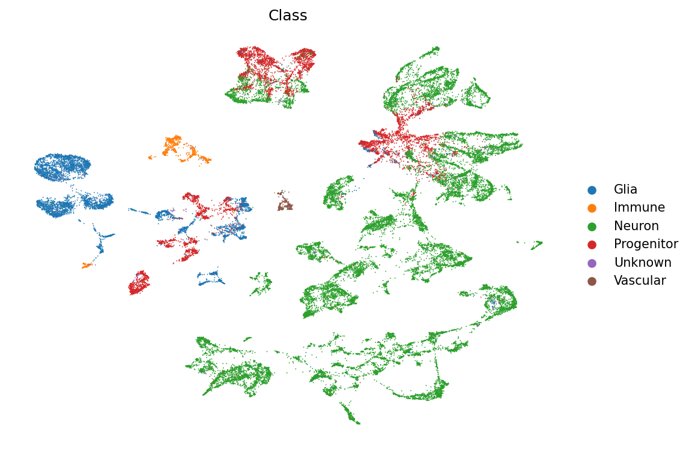
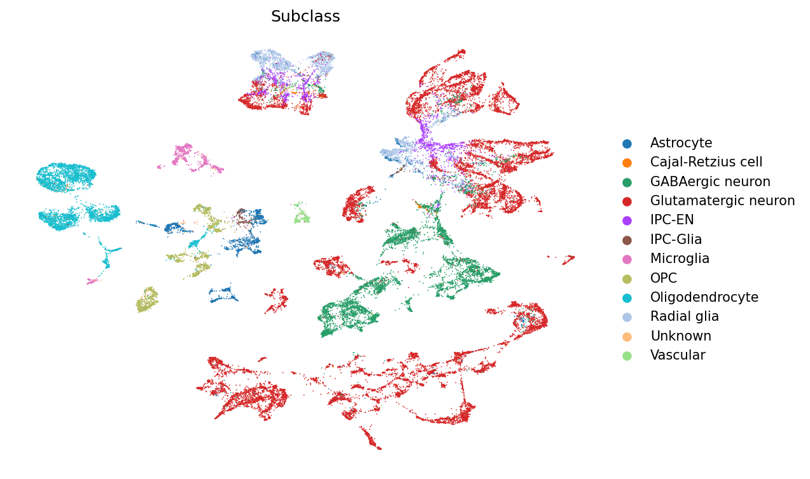
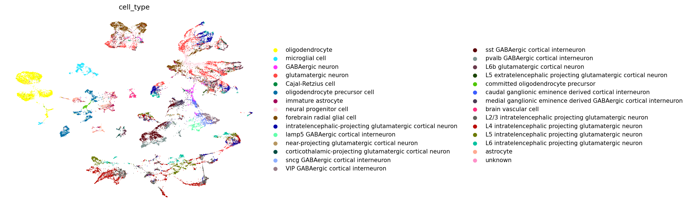
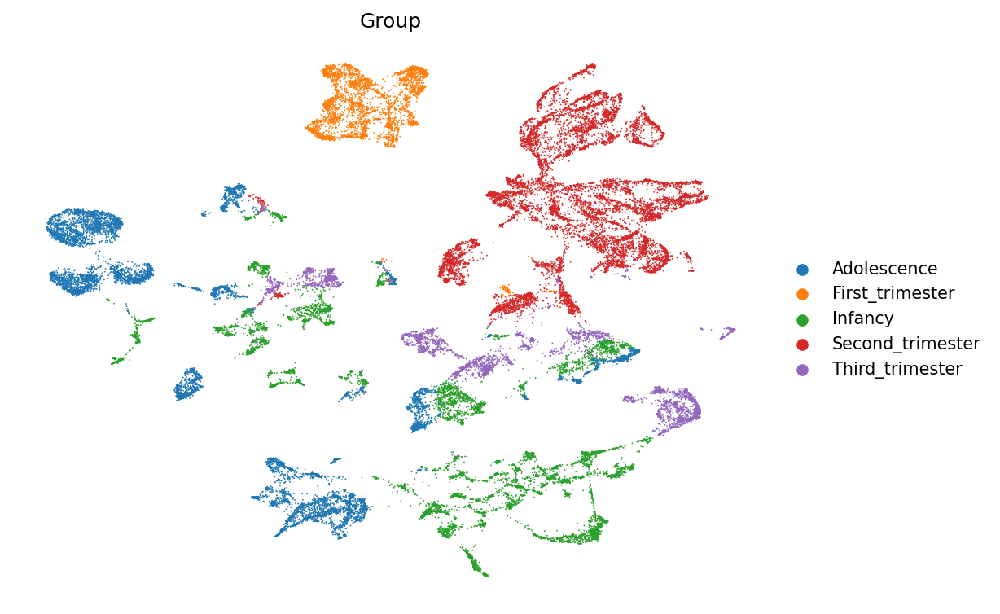
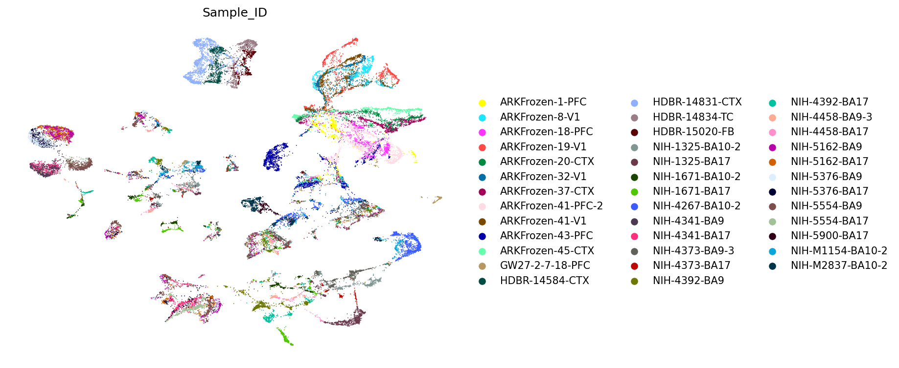
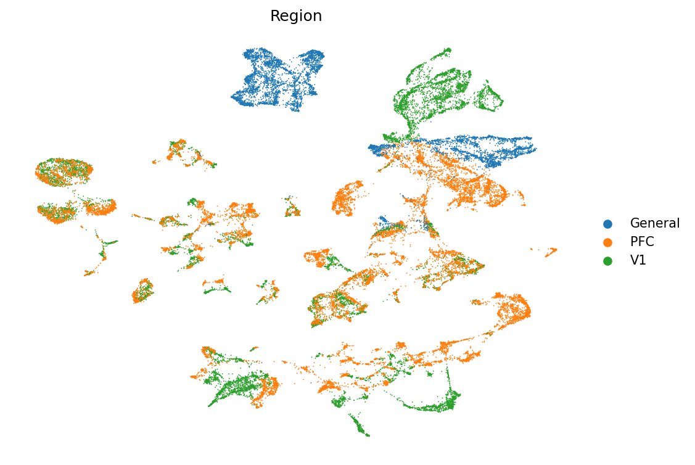

# Solid Recover 迭代报告 — Round 0: Baseline — 原始 SR 模型 (ckpt 10000, 不使用批次信息)

**生成时间**: 2026-05-23 08:47:25
**配置文件**: `/home/rsun@ZHANGroup.local/solid_recover_dev/configs/case_brain_dev_sub.yaml`
**策略**: Baseline — 原始 SR 模型 (ckpt 10000, 不使用批次信息)

## 一、训练概况

> 基线模式 — 未训练，使用已有 embedding。

## 二、超参数

| 参数 | 值 |
|------|----|
| embed_dim | 64 |
| n_cells | 40000 |
| atac_features | 100000 |
| checkpoint | ckpt_10000 (原始模型) |

## 三、定量评估结果 (ARI / NMI)

| Checkpoint | Class ARI | Subclass ARI | cell_type ARI | Class NMI | Subclass NMI | cell_type NMI |
|------|------|------|------|------|------|------|
| 10000 | 0.1257 | 0.4042 | 0.2463 | 0.5595 | 0.3620 | 0.5761 |

> 最佳 Checkpoint: **10000** 步

## 四、UMAP 可视化

### Checkpoint 10000

| Class | Subclass | cell_type |
|------|------|------|
|  |  |  |

| Group | Sample_ID | Region |
|------|------|------|
|  |  |  |

---
*报告由 `scripts/run_iteration.py` 自动生成于 2026-05-23 08:47:25*