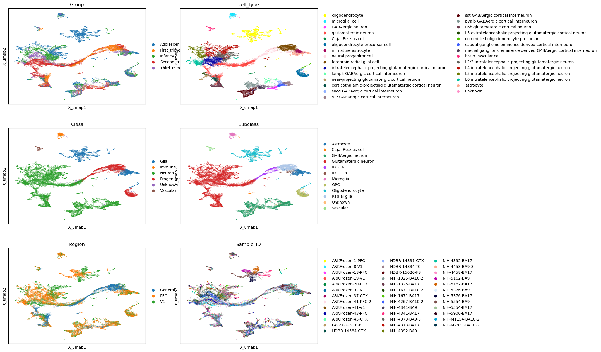
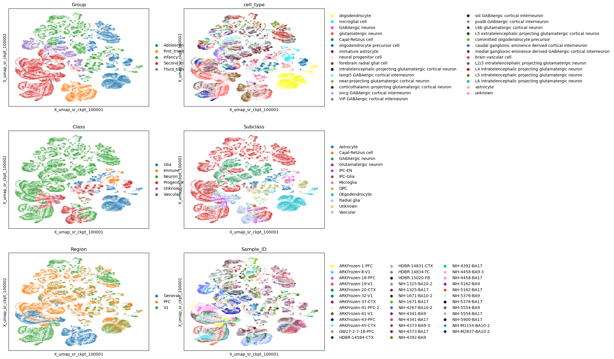

## 行为约束
你当前工作的目录已经是 dev 分支，禁止运行 git checkout main 或 git switch main。
在完成阶段性工作后，请按顺序执行以下命令提交代码：

git add .
git commit -m "feat(agent): 描述你刚才自动完成的工作内容"
git push origin dev

除了当前的工作目录，禁止在其他工作目录下进行删除操作。

## 项目说明
我想要给SR方法打一个补丁，用于提升单细胞多组学多样本数据整合的性能。SR在多组学整合上表现很好（将同一细胞的不同组学
映射入一个特征空间），在多样本整合上表现一般（不能很好的将来自不同细胞的相同细胞类型在UMAP可视化中拉到一起）。你的
工作重点是提升其多样本整合的能力。

## 项目结构
configs/是先前的训练配置 contex/中包含项目的文档说明 ref_report/收集了多个AI提供的单细胞多组学多样本整合的研究报告，
供你参考，scripts/是先前的训练评估脚本，solid_recover是整个项目的代码目录。 

## 数据说明
参考/home/rsun@ZHANGroup.local/solid_recover_dev/configs/case_brain_dev.yaml 中的数据，其中包含多个批次的样本。
该数据为人类新皮层发育的多组学数据
全部的数据包括 train.h5mu + test.h5mu, 大约有200k 个cell, 17k个gene 140k个peaks。
数据中重要的key如下，以mdata['rna_count']为例：
- obs: 
    - Class: 粗粒度的细胞类型
    - Subclass: 中等粒度的细胞类型
    - cell_type: 最细粒度的细胞类型
    - Group: 发育时间，包含Adolescence	First_trimester	Infancy	Second_trimester	Third_trimester
    - Sample_ID: 样本ID
    - Region: 样本位置：General PFC V1 三个脑区
- obsm:
    - X_umap: 原论文中的umap信息（很好的去除了批次效应，没有找到产生这个UMAP的embed）
    - X_pca: 原论文提供的pca表征（似乎没有很好的去除批次效应，并不是直接用于产生X_umap的表征）
    - X_embed_sr_ckpt_{epoch}: 原始SR模型产生的多组学表征，多样本整合效果较差
    - X_umap_sr_ckpt_{epoch}: SR模型表征对应的UMAP可视化 

下面展示原论文整合后的效果：

注意由于缺失对应的embed，无法提供具体指标的量化结果，例如ARI, NMI等，仅能通过对应的UMAP效果展示。可以看到
Class Subclass cell_type 中的各个cluster紧密的聚集在一起，而使用X_embed_sr_ckpt_10000的结果则无法实现上述效果：

## 任务说明
1. 参考ref_report中的文档，规划提升SR方法多样本整合效果的策略，加入solid_recover中。
2. 使用hca_brain_dev数据测试这一功能，为了加速模型的训练推理，我要求进行如下数据处理：
    1. 降采样特征，统计 train.h5mu中 atac 数据中每个peaks的非零比例，保留非零比例最高的前100k个peaks，降低特征数目140k-->100k
    2. 降采样细胞，将 train.h5mu数据降采样为包含40k细胞的train_sub.h5mu 和 20k cell的 test_sub.h5mu。两者细胞无交集。
    3. 将降采样后的数据保存在当前目录下，后续的测试评估都基于这组数据进行。
    4. /home/rsun@ZHANGroup.local/solid_recover_dev/configs/case_brain_dev.yaml 中的训练规模适当调整，总共训练6k步即可，相关的warmup, steady 和 cosine退火进行调整。1500步保留一个ckpt即可。
    5. 测试指标暂时不需要很复杂，每次训练完成后，参考/home/rsun@ZHANGroup.local/solid_recover_dev/scripts/extract_embeddings_umap.py 中的方式生成每个ckpt中 rna embedding的umap可视化，umap的 min_dist 设置为0.2。
    仅需要在train_sub 数据上做可视化即可。test_sub 数据仅在训练中观察loss变化。核心测试指标如下：
        - umap中 class subclass cell_type可视化效果。
        - class subclass cell_type 的 ARI NMI计算结果，这两个指标计算时，在rna embedding生成的 knn图上做leiden聚类，粒度从0.1，0.2，..., 1.5，每个粒度的聚类结果和label算指标，选择 ARI+NMI 最大的那个粒度对应的结果报告。
        - 对于其他可能的指标，不强制要求，最核心的是可视化效果。
3. 每次迭代后，生成完整的迭代报告，实验报告，保存并邮件发送给sunrui171@mails.ucas.edu.cn
4. 根据可视化效果和量化指标不断迭代优化你的方案，你最多可以迭代10轮，如果10轮后还没有达标也要停止。
5. 做好版本管理，按照 ## 行为约束 的要求上传git，新生成的结果中，仅上传图片，文档，代码脚本，不要上传例如train_sub.h5mu这种大规模的数据。
